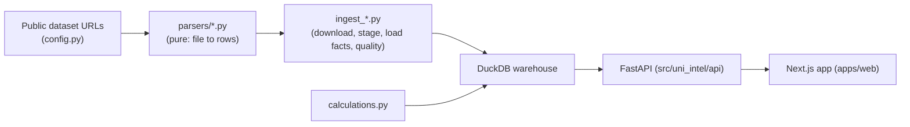

# AGENTS.md

Operational guide for humans and AI coding agents working in this repository.
Read this first, then keep changes consistent with the conventions below.

## What this project is

A local-first data product that ingests Australian higher-education public
datasets into a canonical metric/fact model backed by **DuckDB**, exposed
through a **FastAPI** JSON API and a **Next.js** dashboard.

- Language/runtime: Python 3.11+ (backend + ETL), TypeScript / React 19 / Next.js 16 (web).
- Storage: a single embedded DuckDB warehouse file. No external database.
- Deploy: two Vercel projects (Python API at repo root, Next.js app in `apps/web`).

## Repository map

```text
api/index.py                Vercel serverless entrypoint (re-exports FastAPI app)
apps/web/                   Next.js + Tailwind + Recharts dashboard
data/seed/                  Committed provider + alias seed CSVs
data/raw|warehouse|quality/ Generated artifacts (gitignored)
sql/schema.sql              Canonical DuckDB schema + staging tables
src/uni_intel/
  config.py                 Paths and public dataset URLs (module constants)
  db.py                     DuckDB connection + schema/migration helpers
  seed.py                   Loads seed CSVs into providers/aliases
  api/                      FastAPI app: app factory, routers, repositories, schemas, analytics
  ingestion/                ETL: parsers (pure) + runners (I/O + DB) + metrics + calculations
tests/                      pytest suite (parsers, API, ingestion contracts)
Makefile                    Primary task orchestration
```

## Data flow



## Commands

Run everything through the `Makefile` (it manages the Python venv in `.venv`).

| Command | What it does |
| --- | --- |
| `make bootstrap` | Create `.venv` and install the package with dev extras |
| `make ingest-all` | Download sources and (re)build the DuckDB warehouse |
| `make test` | Run the Python test suite (pytest) |
| `make lint` | Ruff lint (`src`, `tests`) |
| `make format` | Ruff format (writes) |
| `make format-check` | Ruff format check (CI-safe, no writes) |
| `make typecheck-py` | Pyright type check of the Python package (advisory; being adopted incrementally) |
| `make dev` | Run API (`:8000`) + web (`:3000`) locally |
| `make verify` | Full gate: ingest, test, lint, web lint/typecheck/build, smoke |

Web-only (from `apps/web`): `npm run lint`, `npm run typecheck`, `npm run build`,
`npm run smoke` (API availability check), `npm run format` / `npm run format:check`.

## Conventions

- **Keep the public HTTP API contract stable.** `tests/test_api_compare.py` and
  `tests/test_metric_catalog.py` encode it. Change routes only with intent.
- **DuckDB + parameterized raw SQL.** No ORM. Always use `?` placeholders; never
  string-format user/query values into SQL.
- **Ingestion split:** parsers under `ingestion/parsers/` are pure (file to
  dataclass rows, no DB, no network). Runners (`ingest_*.py`) own downloads,
  staging, fact loading, and quality checks. Do not blur these.
- **Share utilities via `ingestion/common.py`** (checksums, ids, upserts, quality
  checks). Do not fork private copies into individual runners.
- **DB access goes through `src/uni_intel/db.py`.** Use its context manager rather
  than calling `duckdb.connect` directly.
- **Prefer small files (< ~400 lines) and single-responsibility modules.**
- **Imports at module top only** (no inline imports; see `.cursor/rules`).
- **Type hints on public functions.** Add Pydantic response models for new API
  routes.

## Gotchas

- **Serverless DB inflation:** in production the API reads
  `data/warehouse/university_intel.duckdb.gz` and inflates it into `/tmp` on cold
  start (`db.resolve_db_path`). Locally it reads the uncompressed file built by
  `make ingest-all`. Resolution order is: local file, warm `/tmp` file, committed
  gzip archive, then a remote archive from `UNI_INTEL_DB_URL`. The API opens one
  read-only connection per warehouse and hands each request a cursor
  (`api/deps.py`), so warm requests do not re-open the database.
- **The ~32MB committed archive** (`university_intel.duckdb.gz`) bloats git history
  on every data refresh. To host it off-git, upload the archive to object storage
  and set `UNI_INTEL_DB_URL`; the API will fetch it on cold start. Removing the
  archive from git history requires a history rewrite and is intentionally not
  done automatically.
- **Canonical scope selection:** when no `scope` is given, the API picks one
  canonical `dimension_scope` per provider/metric via a `QUALIFY ROW_NUMBER()`
  window (`api/analytics.py`) to avoid double-counting dual-sector providers.
- **Metric aliasing:** some finance metric ids were renamed; the API maps legacy
  ids to canonical ones (`METRIC_HISTORY_ALIASES`) so history stays continuous.
- **`requirements.txt`** is the pinned runtime dependency set consumed by Vercel's
  `@vercel/python` builder. `pyproject.toml` is the source of truth for the full
  dependency graph (runtime + dev); keep the two runtime lists aligned.

## Adding a dataset

1. Add source URLs to `src/uni_intel/config.py`.
2. Add metric definitions in `src/uni_intel/ingestion/metrics.py`.
3. Create a pure parser under `src/uni_intel/ingestion/parsers/`.
4. Create a runner that downloads, registers source metadata, stages rows,
   resolves providers, loads facts, and writes quality checks (reuse `common.py`).
5. Register the runner in `src/uni_intel/ingestion/ingest_all.py`.
6. Add parser and ingestion-contract tests under `tests/`.
7. Expose new metrics through the API/frontend selectors.

## Before you finish

Run `make lint format-check typecheck-py test` for backend changes and
`npm run lint && npm run typecheck && npm run build` in `apps/web` for frontend
changes. Prefer `make verify` for anything cross-cutting.
